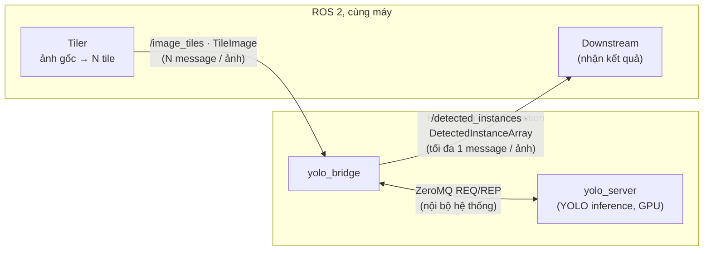
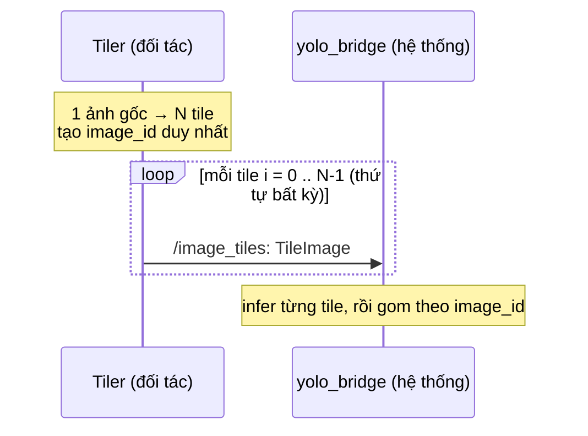
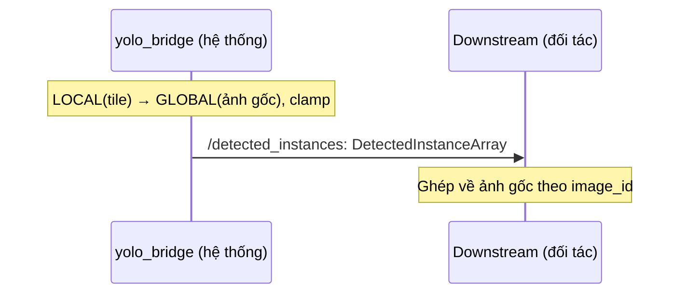

# Đặc tả tích hợp ROS 2 YOLO Detection (bản prototype)

## Lịch sử chỉnh sửa

| Ngày | Phiên bản tài liệu | Nội dung |
| --- | --- | --- |
| 2026-07-17 | 1.1.0 | Chuẩn hoá tên thành YOLO Detection; cập nhật topic, message và field mảng của output. |
| 2026-07-13 | 1.0.0 | Bản nháp v1.0.0 |

## Mục lục

1. [Điều kiện kết nối bắt buộc](#connection)
2. [Luồng xử lý và giới hạn thông lượng](#flow)
3. [Đầu vào — tile ảnh](#input)
4. [Đầu ra — kết quả nhận diện](#output)
5. [Lưu ý khi tích hợp](#checklist)

## Bảng thuật ngữ

| Thuật ngữ | Ý nghĩa |
| --- | --- |
| Message / `.msg` | Cấu trúc dữ liệu đã định nghĩa trước trong ROS 2. Hai bên phải dùng đúng cùng định nghĩa `robot_ai_interfaces` để hiểu dữ liệu giống nhau. |
| Type hash | Mã nhận diện được ROS 2 dùng để xác nhận hai bên có cùng cấu trúc message. Nếu khác `.msg`, publisher và subscriber có thể không kết nối được. |
| `ROS_DOMAIN_ID` | Số phân vùng ROS 2. Chỉ các node cùng domain mới nhìn thấy nhau; hệ thống hiện dùng `0`. |
| Discovery | Cơ chế ROS 2 tự tìm các node/topic trong cùng domain. `LOCALHOST` giới hạn việc tìm kiếm trong chính máy đang chạy. |
| QoS | Quy tắc giao nhận message, như độ tin cậy, số message được đệm và việc có phát lại dữ liệu cũ hay không. |
| `reliable` / `volatile` | `reliable` yêu cầu middleware cố gắng giao message tin cậy. `volatile` nghĩa là subscriber mới kết nối không nhận lại kết quả đã phát trước đó. |
| Tile | Một phần ảnh nhỏ được cắt từ ảnh gốc để model xử lý. Một ảnh gốc được gửi dưới dạng nhiều tile. |
| ZeroMQ REQ/REP | Cơ chế giao tiếp nội bộ: bridge gửi một yêu cầu (REQ) chứa ảnh tile, rồi chờ một phản hồi (REP) từ `yolo_server`. |
| Aggregator | Thành phần gom detection từ các tile cùng `image_id` trước khi phát một kết quả cho ảnh gốc. |
| LOCAL / GLOBAL | LOCAL là toạ độ bên trong tile. GLOBAL là toạ độ trên toàn ảnh gốc sau khi cộng `x_offset` và `y_offset`. |
| Instance segmentation | Phương pháp nhận diện từng đối tượng độc lập và trả về class cùng đường bao cho mỗi đối tượng. |
| Polygon | Danh sách các điểm tạo đường bao đối tượng; có khi model segmentation trả về. Nếu chỉ detect bbox, danh sách này rỗng. |
| Clamp | Giới hạn toạ độ nằm trong biên ảnh gốc, tránh bbox hoặc polygon vượt ra ngoài ảnh. |
| NMS / dedup | Các kỹ thuật loại bỏ detection trùng nhau. Hệ thống hiện chưa thực hiện giữa các tile, nên tile overlap có thể cho kết quả trùng. |

---

## 1. Điều kiện kết nối bắt buộc

| Yêu cầu | Chi tiết |
| --- | --- |
| ROS | ROS2 **Jazzy** |
| Python | **3.12** cho node chạy native trên host. Nếu chạy trong container, dùng Python đi kèm image của hệ thống. |
| Docker | Docker Engine **29.x** (môi trường hiện tại đã kiểm chứng: **29.1.5**) |
| Message package | Build và source `robot_ai_interfaces` từ **đúng cùng revision/tag** với hệ thống. Không tự chép/sửa `.msg`; type hash phải khớp. |
| `ROS_DOMAIN_ID` | Hai bên phải giống nhau; hệ thống mặc định `0`. |
| Discovery cùng máy | Hệ thống dùng `ROS_AUTOMATIC_DISCOVERY_RANGE=LOCALHOST`. Node đối tác phải chạy trên cùng host/loopback: native trên host hoặc container `network_mode: host`. Đặt cùng biến này ở phía đối tác để discovery chỉ dùng loopback. Container bridge riêng sẽ không thấy hệ thống. |
| Encoding ảnh | `sensor_msgs/Image.encoding = bgr8`. |
| Trust boundary | ROS 2 topic trong phạm vi này không có xác thực ở contract hiện tại. Chỉ chạy các process/container được tin cậy trong cùng host và domain. |

Sau khi build package, source workspace của đối tác trước khi chạy node. Xác nhận discovery/type bằng:

```bash
ros2 topic info /image_tiles -v
ros2 topic info /detected_instances -v
```

Hai topic dùng QoS mặc định: **reliable, keep-last depth 10, volatile**. Subscriber phải chạy trước khi kết quả được publish; publisher không phát lại kết quả cũ cho late-joiner.

---

## 2. Luồng xử lý và giới hạn thông lượng



- Bên tiler publish `/image_tiles`; downstream subscribe `/detected_instances`.
- Thứ tự tile có thể bất kỳ. Bridge gom theo `image_id` và `tile_index`.
- Mỗi tile được YOLO xử lý tuần tự qua ZeroMQ REQ/REP. Thời gian một ảnh xấp xỉ tổng thời gian inference của các tile, nên FPS/số frame in-flight phải được benchmark trên GPU thực tế trước khi chốt.
- Không có global NMS/dedup giữa các tile. Nếu dùng overlap, cùng một vật có thể xuất hiện nhiều lần trong `instances[]`; đối tác cần chốt chính sách không overlap, ownership vùng overlap, hoặc downstream dedup.

---

## 3. Đầu vào — tile ảnh (`/image_tiles`)



- **Topic:** `/image_tiles`
- **Type:** `robot_ai_interfaces/msg/TileImage`
- **QoS:** reliable, keep-last depth 10, volatile.

### 3.1. Định nghĩa `TileImage`

```
std_msgs/Header header
string   image_id
uint16   tile_index
uint16   tile_row
uint16   tile_col
uint16   num_tiles
uint32   x_offset
uint32   y_offset
uint32   tile_width
uint32   tile_height
uint32   orig_width
uint32   orig_height
sensor_msgs/Image image
```

| Field | Ý nghĩa | Ràng buộc bắt buộc |
| --- | --- | --- |
| `header.stamp` | Thời điểm chụp ảnh | Mọi tile của một `image_id` dùng cùng stamp. |
| `header.frame_id` | Frame nguồn (tuỳ chọn) | Có thể để trống; output dùng `image_id` để trace. |
| `image_id` | ID duy nhất của ảnh gốc | Dùng dạng `source/timestamp/sequence`; không tái sử dụng. |
| `tile_index` | Chỉ số tile | Mỗi giá trị `0..num_tiles-1` xuất hiện đúng một lần. |
| `tile_row`, `tile_col` | Vị trí lưới | Chỉ phục vụ trace/debug; bridge không dùng để ghép. |
| `num_tiles` | Tổng số tile | `> 0`; phải giống nhau ở mọi tile của ảnh. |
| `x_offset`, `y_offset` | Góc trái-trên tile trong ảnh gốc | Theo pixel và phải chính xác. |
| `tile_width`, `tile_height` | Kích thước tile | Phải đúng với kích thước thực của `image`. |
| `orig_width`, `orig_height` | Kích thước ảnh gốc | `> 0`; phải giống nhau ở mọi tile; dùng để clamp output. |
| `image` | Pixel của tile | `bgr8`; dữ liệu ảnh phải hợp lệ. |

### 3.2. Quy ước đầu vào

- Các tile của cùng ảnh có thể đến lệch thứ tự, nhưng không được thiếu, thừa hoặc trùng index.
- Nếu metadata giữa các tile không nhất quán, index ngoài range, ảnh rỗng hoặc encode/inference lỗi, kết quả là **không xác định theo contract hiện tại**. Publisher phải chặn các trường hợp này trước khi publish.
- Tile trùng có thể bị bỏ ở giai đoạn gom kết quả; không dùng nó như cơ chế retry.
- Sau khi một ảnh đã hoàn tất, bridge chỉ giữ một cache giới hạn các `image_id` đã xong. Vì vậy không được dựa vào việc gửi lại ID cũ sẽ luôn bị bỏ.

**Ví dụ** — ảnh `3840×2160` chia `4×3 = 12` tile, tile cuối:

```
image_id="camera-a/2026-07-13T09:20:15.123Z/7f3e",
tile_index=11, tile_row=2, tile_col=3, num_tiles=12,
x_offset=2880, y_offset=1440, tile_width=960, tile_height=720,
orig_width=3840, orig_height=2160, image=<bgr8 960x720>
```

---

## 4. Đầu ra — kết quả nhận diện (`/detected_instances`)



- **Topic:** `/detected_instances`
- **Type:** `robot_ai_interfaces/msg/DetectedInstanceArray`
- **QoS:** reliable, keep-last depth 10, volatile.

### 4.1. Điều kiện phát kết quả

Bridge tạo output trong hai trường hợp:

1. **Complete:** nhận đủ `num_tiles` tile có inference thành công, mỗi `tile_index` là duy nhất.
2. **Timeout partial:** đã có ít nhất một tile inference thành công nhưng chưa đủ tile sau aggregation timeout hiện tại là **2 giây**. Timer kiểm tra mỗi 0,5 giây, nên đây không phải SLA thời gian thực chính xác.

Nếu tile không encode được hoặc YOLO timeout, tile đó không vào aggregator. Nếu **không có tile nào** inference thành công cho một `image_id`, hiện không có buffer để flush và **không có output** cho ảnh đó.

Schema hiện chưa có `status`, `received_tiles` hay `expected_tiles`; downstream **không thể phân biệt** complete, partial, hoặc `instances=[]` do không có detection. Do đó chỉ xem `instances=[]` là kết quả “không phát hiện” khi quy trình vận hành đã bảo đảm đầy đủ tile được xử lý. Nếu cần quyết định an toàn/production, contract cần được mở rộng bằng metadata trạng thái.

### 4.2. Cấu trúc message kết quả

```
# DetectedInstanceArray.msg
std_msgs/Header header        # frame_id = image_id
string         image_id
DetectedInstance[] instances

# DetectedInstance.msg
string                class_name
float32               score
BBox2D                bbox
geometry_msgs/Polygon polygon

# BBox2D.msg
float32 center_x
float32 center_y
float32 size_x
float32 size_y
```

| Field | Ý nghĩa và quy ước |
| --- | --- |
| <code>header.frame_id</code> | Bridge đặt bằng <code>image_id</code> để trace. |
| <code>header.stamp</code> | Stamp của ảnh gốc từ input. |
| <code>image_id</code> | Khớp ID đã gửi; dùng để ghép kết quả. |
| <code>instances[].class_name</code> | Tên class được định nghĩa trong production weights. Giá trị output chỉ thuộc danh sách class của model đã triển khai. |
| <code>instances[].score</code> | Confidence trong khoảng <code>[0..1]</code>. |
| <code>instances[].bbox</code> | Bbox GLOBAL trên ảnh gốc, định dạng center + size, đơn vị pixel. |
| <code>instances[].polygon.points[]</code> | Polygon GLOBAL nếu model trả segmentation; rỗng với detection-only. Mỗi point dùng toạ độ <code>x</code>, <code>y</code> theo pixel ảnh gốc. |

**Quy ước toạ độ:** gốc `(0,0)` ở góc trái-trên. Bridge clamp bbox/polygon vào biên liên tục `[0..orig_width] × [0..orig_height]`; vì thế cạnh phải/dưới có thể bằng `orig_width`/`orig_height` (khác với chỉ số tâm pixel cuối là `width - 1`/`height - 1`).

**Đổi center/size sang góc:**

```
x1 = center_x - size_x / 2
y1 = center_y - size_y / 2
x2 = center_x + size_x / 2
y2 = center_y + size_y / 2
```

Thứ tự `instances[]` không phải một cam kết API; không dùng vị trí trong mảng làm định danh.

**Ví dụ output** (JSON minh hoạ):

```json
{
  "image_id": "camera-a/2026-07-13T09:20:15.123Z/7f3e",
  "header": {
    "frame_id": "camera-a/2026-07-13T09:20:15.123Z/7f3e",
    "stamp": { "sec": 1783934415, "nanosec": 123000000 }
  },
  "instances": [
    {
      "class_name": "target_class",
      "score": 0.91,
      "bbox": {
        "center_x": 848.5,
        "center_y": 1292.6,
        "size_x": 79.7,
        "size_y": 269.5
      },
      "polygon": {
        "points": [
          { "x": 810, "y": 1157 },
          { "x": 888, "y": 1157 },
          { "x": 888, "y": 1427 },
          { "x": 810, "y": 1427 }
        ]
      }
    }
  ]
}
```

Giá trị <code>target_class</code> ở trên dùng để minh hoạ định dạng message. Giá trị thực tế lấy theo tên class được định nghĩa trong production weights.

### 4.3. Đối tượng nhận diện và định nghĩa class

Mỗi phần tử trong <code>instances[]</code> biểu diễn một đối tượng được nhận diện trong ảnh. Mỗi đối tượng có <code>class_name</code>, bbox song song với trục ảnh và polygon nếu sử dụng model segmentation. Bbox không có góc xoay.

Đối tượng nhận diện và <code>class_name</code> được định nghĩa bởi production weights. Đặc tả này không giới hạn một loại đối tượng hoặc class cụ thể.

| Hạng mục | Định nghĩa |
| --- | --- |
| Đối tượng nhận diện | Đối tượng detection hoặc segmentation được định nghĩa trong production weights. |
| <code>class_name</code> | Tên class model trả về; output chỉ thuộc danh sách class của production weights. |

Bridge trả nguyên tên class của model. Hai bên phải thống nhất tên class và phạm vi đối tượng nhận diện trước khi triển khai.

---

## 5. Lưu ý khi tích hợp

Sử dụng cùng ROS 2 domain, message package và đúng metadata cho mọi tile của một ảnh. Subscribe `/detected_instances` trước khi publish input, sau đó ghép kết quả theo `image_id`.

Nếu không nhận được kết quả, kiểm tra `ros2 topic info -v` và log `yolo_bridge`. Khi toàn bộ tile timeout hoặc lỗi, hệ thống hiện không phát output cho ảnh đó.

Trước khi triển khai, cần thống nhất weights/class, FPS, tile overlap và cách xử lý kết quả partial.
